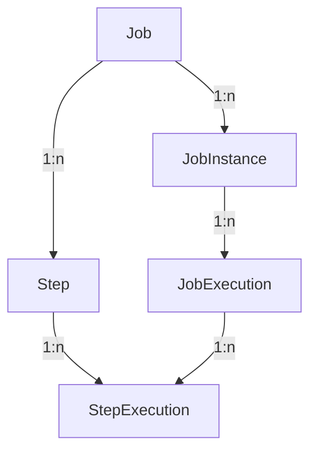
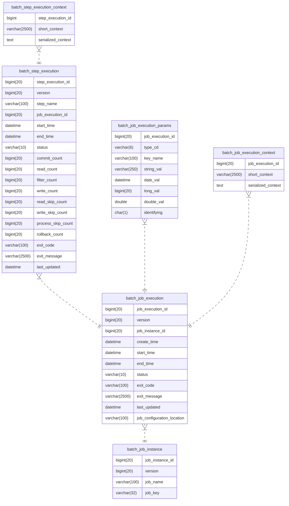

# Mermaid

## General

[Mermaid](https://mermaid.js.org/syntax/flowchart.html) is a nice javascript library that can be used within markdown to render simple diagrams, from flow charts like



defined by code like

````markdown

````

to entity relation ship diagrams like this spring batch one



defined by:

````markdown

````

Use the mermaid [live editor](https://mermaid.live/edit) for toying around!

Mermaid is supported by GitHub as well as GitLab.

## Confluence

Sadly, when importing Markdown in Confluence, Mermaid diagrams are not automatically converted. Instead, if not using plug ins, one has to import them via [draw.io](https://drawio-app.com/blog/create-mermaid-diagrams-in-draw-io/) manually:

1. Select the draw.io macro in your Confluence by typing / which brings up the macros menu.
1. Choose a blank diagram and don't forget to give your new diagram a name.
1. Go to the toolbar and select the + symbol.
    (You can also insert a mermaid diagram using the menu bar: Arrange > Insert > Advanced > Mermaid)
    Select Advanced and then Mermaid.
1. A dialog box will pop up where you can enter the text for the diagram you want to create.

## Mark

To use mermaid with [mark](https://github.com/kovetskiy/mark) to push your markdown files to confluence, one has to possibilities

1. The Confluence plugin [Cloudscript.io Mermaid Addon](https://marketplace.atlassian.com/apps/1219878/cloudscript-io-mermaid-addon?tab=overview&hosting=cloud) is enabled. Then `mark` will use this plugin (default, to be explicit: `mermaid-go`)
1. mark renders the mermaid diagrams itself, creates temporary images and pushes them to confluence. Use the flag `--mermaid-provider mermaid-go` for this
