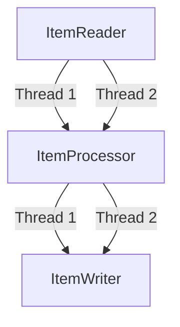
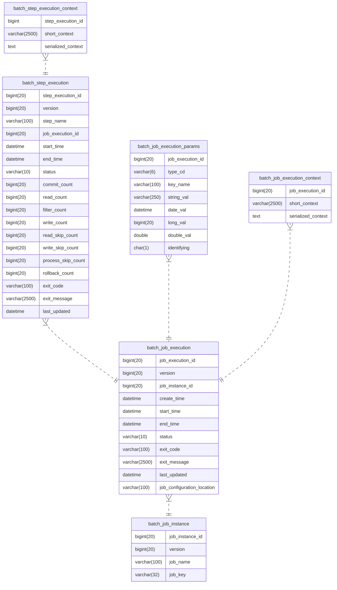

# Spring Batch

## Parallel Processing

From the [documentation](https://docs.spring.io/spring-batch/docs/current/reference/html/index-single.html#scalability):

>Spring Batch offers a range of options, which are described in this chapter, although some features are covered elsewhere. At a high level, there are two modes of parallel processing:
>
> - Single-process, multi-threaded
>
> - Multi-process
>
>These break down into categories as well, as follows:
>
> - Multi-threaded Step (single-process)
>
> - Parallel Steps (single-process)
>
> - Remote Chunking of Step (multi-process)
>
> - Partitioning a Step (single or multi-process)

Some additional information from the docs:

- Multi-threaded Step (single-process): Each chunk is treated in different thread
- Parallel Steps (single-process): Processes step flows (can be different flows like step1->step2 and another flow with just step3) in parallel
- Remote Chunking of Step (multi-process): The manager provides the chunks (i.e. controls `ItemReader`)
- Partitioning a Step (single or multi-process):

Note that the threads in a multi-threaded step seem to share the same instances of `ItemReader`, `ItemProcessor` and `ItemWriter`:

This can lead to confusing when the instances write to their corresponding step contexts.

## Spring Batch meta data schema

Here is entity relationship diagram of the Spring Batch [meta table schema](https://docs.spring.io/spring-batch/docs/current/reference/html/index-single.html#metaDataSchema):

Hence, to empty all Spring Batch meta tables, it suffices to execute `truncate batch_job_instance cascade`.
