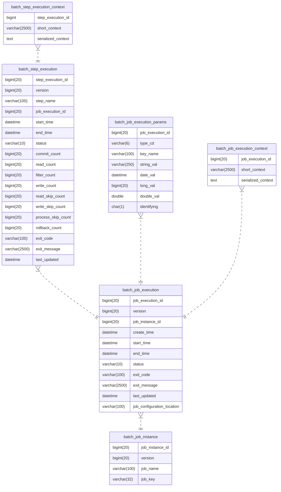

# Spring Batch

## Spring Batch meta data schema

Here is entity relationship diagram of the Spring Batch [meta table schema](https://docs.spring.io/spring-batch/docs/current/reference/html/index-single.html#metaDataSchema):

Hence, to empty all Spring Batch meta tables, it suffices to execute `truncate batch_job_instance cascade`.
